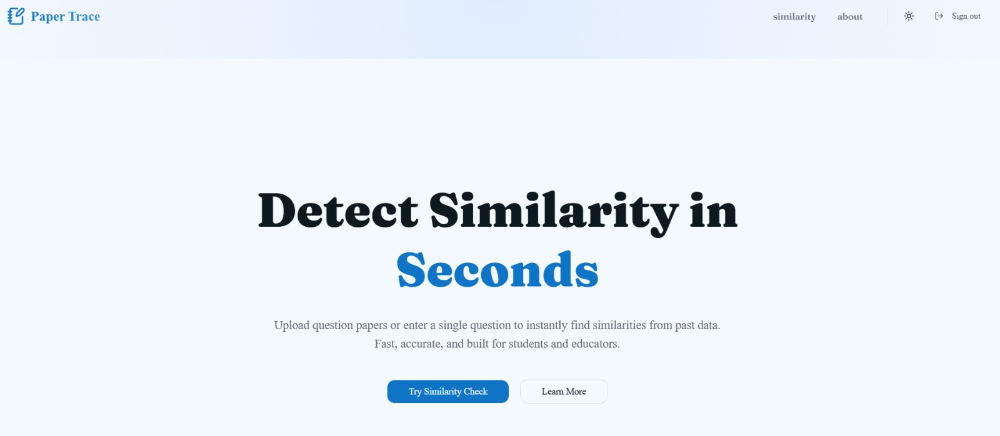
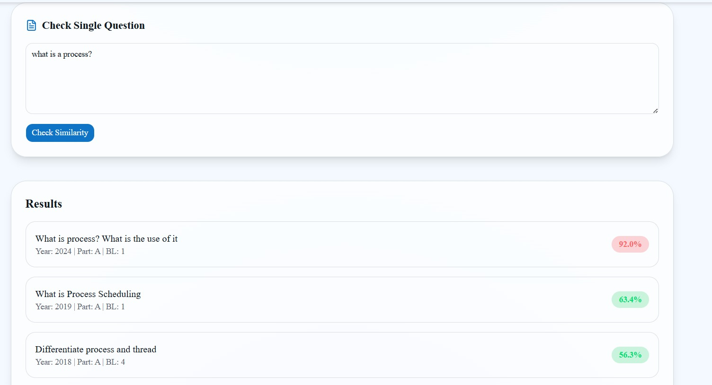
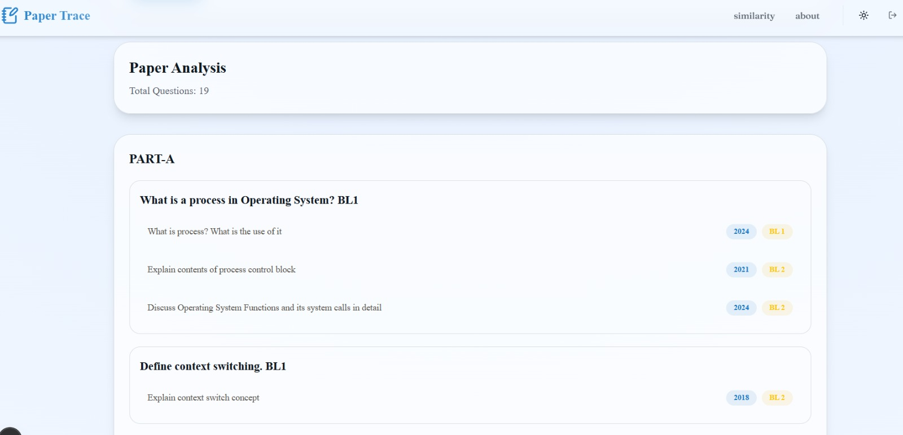
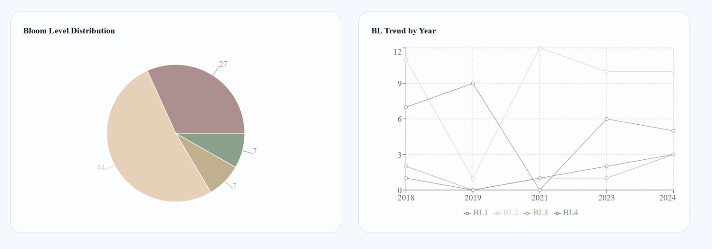
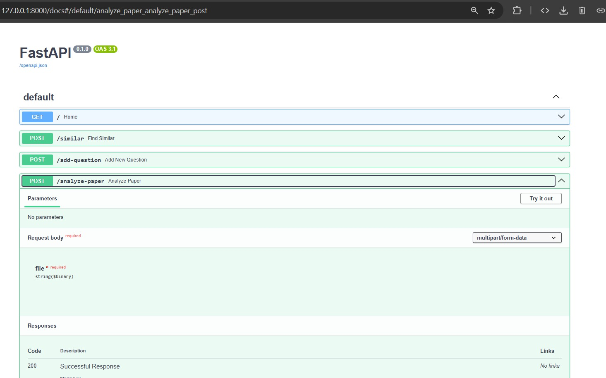
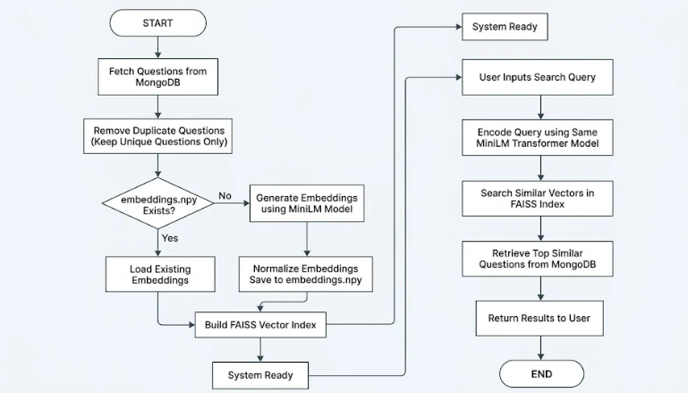

# Paper Trace — AI-Powered Question Auditing System

Paper Trace is an **AI-powered question auditing platform** designed to help educational institutions identify **repeated and semantically similar examination questions** before question papers are finalized.

The platform combines **SBERT embeddings, FAISS vector search, Bloom's Level analytics, and historical question repositories** to provide intelligent audit reports and improve question bank quality.


---

# Vision

Educational institutions often struggle with repeated questions appearing across examinations, leading to reduced assessment diversity and increased manual review effort.

Paper Trace provides an intelligent auditing platform that enables faculty and examination teams to detect semantically similar questions, analyze historical trends, and maintain high-quality question repositories.

The current implementation focuses on a single subject and can be extended to support multi-subject auditing in the future.

---

# Landing Page

The landing page introduces the Paper Trace platform and its purpose in academic question auditing.



The interface provides:

* platform overview
* semantic audit workflow introduction
* quick navigation to analysis tools
* authentication access

---

# Single Question Analysis

Faculty can analyze individual questions against the historical repository.

The system:

* generates SBERT embeddings
* performs FAISS similarity search
* retrieves related historical questions
* displays contextual metadata such as year and Bloom's Level

📷 **Screenshot:**



---

# Question Paper Analysis

Paper Trace supports complete examination paper auditing through PDF uploads.

Workflow:

```text
Upload Question Paper
        ↓
Question Extraction
        ↓
SBERT Embedding Generation
        ↓
FAISS Similarity Search
        ↓
Historical Question Matching
        ↓
Audit Report Generation
```

Features:

* automatic PDF parsing
* PART-A question extraction
* PART-B and UNIT-wise extraction
* semantic similarity matching
* repeated question detection
* historical metadata retrieval

The platform compares every extracted question against a repository of historical departmental questions stored in MongoDB.

📷 **Screenshot:**



---

# Historical Question Repository

Paper Trace audits papers against a repository containing approximately **200 historical departmental questions**.

Each question contains metadata such as:

* examination year
* Bloom's Level
* question category
* vector reference ID

This repository serves as the knowledge base for semantic auditing.

---

# Semantic Search Engine

The platform uses **Sentence-BERT (all-MiniLM-L6-v2)** to understand question meaning rather than relying on exact keyword matches.

Features:

* semantic embeddings
* contextual similarity matching
* duplicate detection
* top-k nearest-neighbor retrieval

This allows the system to identify conceptually similar questions even when phrased differently.

---

# FAISS Vector Search

Paper Trace uses **FAISS (Facebook AI Similarity Search)** for efficient vector retrieval.

Features:

* high-speed nearest-neighbor search
* scalable vector indexing
* semantic similarity retrieval
* low-latency matching

FAISS enables fast comparison between newly submitted questions and the historical repository.

---

# Hybrid MongoDB–FAISS Architecture

The platform follows a hybrid architecture:

* MongoDB stores all question records
* FAISS stores embeddings for unique questions only
* vector IDs connect MongoDB records with FAISS vectors
* duplicate embeddings are avoided

This design reduces storage overhead while maintaining fast retrieval performance.

---

# Analytics Dashboard

Paper Trace provides analytics to help faculty understand repository quality and examination trends.

Available insights include:

### Bloom Level Distribution

Visual breakdown of question distribution across Bloom's Levels.

### Bloom Level Trends

Year-wise Bloom's Level analysis to identify assessment trends.

### Average Difficulty Analysis

Tracks changes in overall assessment difficulty over time.

### Part-wise Bloom Analysis

Analyzes Bloom's Level distribution across examination sections.

### Most Repeated Questions

Highlights frequently reused questions within the repository.

📷 **Screenshot:**



---

# Authentication

The platform uses **JWT-based authentication** to secure all core functionality.

Protected features include:

* single question analysis
* question paper auditing
* analytics dashboard
* question management APIs

---

# API Documentation

The backend exposes interactive API documentation using FastAPI Swagger UI.

Available APIs include:

* semantic search
* question insertion
* question paper analysis
* analytics retrieval

Developers can test endpoints directly from the browser.

📷 **Screenshot:**



---

# System Architecture

High-level system flow:

```text
User
  ↓
Next.js Frontend
  ↓
Node.js / Express Backend
  ↓
Python Semantic Engine
(SBERT + FAISS)
  ↓
MongoDB Repository
```

📷 **Architecture Diagram:**



---

# AI & Search Components

### Sentence-BERT (all-MiniLM-L6-v2)

Purpose:

* generate semantic embeddings
* capture contextual meaning
* improve retrieval accuracy

### FAISS

Purpose:

* vector indexing
* nearest-neighbor retrieval
* semantic similarity search

---

# Tech Stack

### Frontend

* Next.js
* React
* Tailwind CSS

### Backend

* Node.js
* Express.js
* FastAPI

### Database

* MongoDB

### AI & Search

* Sentence Transformers (SBERT)
* all-MiniLM-L6-v2
* FAISS

### Authentication

* JWT Authentication

### PDF Processing

* PyMuPDF

---

# Installation

Clone the repository:

```bash
git clone https://github.com/vkrafted21/trebs.git
```

Install frontend dependencies:

```bash
npm install
```

Install Python dependencies:

```bash
pip install -r requirements.txt
```

Run the frontend:

```bash
npm run dev
```

Run the semantic engine:

```bash
uvicorn main:app --reload
```

---

# Future Improvements

Planned enhancements include:

* multi-subject support
* automatic Bloom's Level prediction
* LLM-assisted audit explanations
* downloadable audit reports
* question clustering
* syllabus coverage analysis
* institution-wide repositories
* advanced faculty dashboards

---

# Repository

GitHub Repository:

https://github.com/vkrafted21/trebs

---

# Outcome

* building AI-powered educational assessment systems
* implementing semantic search using SBERT embeddings
* integrating FAISS for large-scale vector retrieval
* designing hybrid MongoDB–FAISS architectures
* automating examination question auditing workflows
* developing analytics-driven question bank management tools
